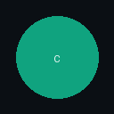

# 🌌 Fenix AstroTab

<div align="center">
  
  <h3>Премиальное расширение «Новая вкладка» (New Tab Page) для Chromium-браузеров</h3>
  <p><i>Живой интерактивный космос, физика дождя, эффект акрилового стекла с преломлением света и лаунчер для ИИ-ассистентов.</i></p>

  <p>
    
    
    
  </p>

  <h4>Разработчик и дизайнер: <a href="https://github.com/FenixUzb">FenixUzb</a> 🌟</h4>
</div>

---

## 🌟 О проекте

**Fenix AstroTab** — это высокотехнологичное расширение, заменяющее стандартную страницу новой вкладки в браузерах Chrome, Edge, Opera, Yandex и др. Оно сочетает в себе потрясающие визуальные эффекты, современные веб-технологии рендеринга и удобные виджеты для продуктивной работы с искусственным интеллектом.

Основная концепция дизайна — **космический реализм и матовое стекло** (Glassmorphic Space Aesthetics), где фоновое звёздное небо физически взаимодействует с элементами интерфейса.

---

## ✨ Ключевые особенности и эффекты

### 1. 🌠 Интерактивный 3D-Космос (Starfield Engine)
* **Параллакс-глубина:** Звёзды реагируют на перемещение мыши, создавая завораживающее ощущение объёмного полёта.
* **Черная дыра:** Гравитационное линзирование в центре экрана искривляет траекторию и свет пролетающих мимо звёзд.
* **Космические явления:** Реализованы алгоритмы генерации полярного сияния (Aurora), пролетающих метеоров (звездопад) и туманностей.
* **Режим гиперпрыжка (Warp Flight):** Мгновенное переключение между спокойным звёздным небом и высокой скоростью полёта.

### 2. 🧪 Эффект Акрилового Стекла с Преломлением (Bevel Refraction)
* **Реалистичные фаски:** Края стеклянных панелей имеют скошенные грани, которые преломляют свет проходящих под ними звёзд.
* **Хроматическая аберрация:** Физическая симуляция расщепления света на спектральные каналы (RGB) на границах преломления.
* **Acrylic Noise:** Наложение микрозернистой текстуры шума на стеклянные элементы для создания эффекта премиального матового стекла.

### 3. 🌧️ Дождь на стекле (Rain Glass Simulation)
* **Динамическая физика капель:** На поверхности панелей генерируются капли дождя, которые реалистично стекают под действием гравитации и сливаются друг с другом.
* **Влажный след:** Стекающие капли временно «очищают» матовое стекло, убирая эффект размытия (Blur) и оставляя прозрачный реалистичный след.

### 4. 🕰️ Умные виджеты и Интеграции
* **Временной прогресс:**
  * Индикатор прохождения текущих суток (в процентах).
  * Индикатор рабочего времени (по будням с 9:00 до 18:00) с обратным отсчётом до окончания дня.
* **Астрономия:** Автоматический расчёт и визуализация текущей фазы Луны с красивыми пиктограммами.
* **Погода без ключей:** Автоматическое определение локации и мгновенный запрос погоды через бесплатное API Open-Meteo.
* **AI Launchpad (Панель ИИ):** Быстрый доступ к ИИ-ассистентам с официальными минималистичными иконками:
  * **ChatGPT** (OpenAI)
  * **Google Gemini**
  * **Claude AI** (Anthropic)
  * **YouTube** (в Feather-стиле обводки для гармонии интерфейса)

---

## ⌨️ Горячие клавиши (Hotkeys)

Для молниеносной навигации прямо на новой вкладке настроены следующие горячие клавиши:

| Клавиша | Действие |
| :---: | :--- |
| `1` | Открыть **ChatGPT** |
| `2` | Открыть **Google Gemini** |
| `3` | Открыть **Claude AI** |
| `0` | Открыть **YouTube** |
| `Alt + G` | Глобальное сочетание клавиш для мгновенной фокусировки на вкладке ChatGPT |

> [!TIP]
> **Кастомное контекстное меню:** Вы можете выделить абсолютно любой текст на веб-странице, нажать правую кнопку мыши и выбрать пункт **«Вставить в ChatGPT»** — расширение само откроет вкладку ИИ и вставит туда скопированный текст.

---

## 🛠️ Руководство по установке

Установка расширения занимает меньше минуты:

1. Склонируйте репозиторий или скачайте архив с кодом проекта:
   ```bash
   git clone https://github.com/FenixUzb/Fenix-AstroTab.git
   ```
2. Откройте ваш браузер на базе Chromium и перейдите в раздел расширений:
   * **Microsoft Edge:** `edge://extensions/`
   * **Google Chrome:** `chrome://extensions/`
   * **Яндекс Браузер / Opera:** `browser://extensions/` / `opera://extensions/`
3. В правом верхнем углу включите **«Режим разработчика»** (Developer mode).
4. Нажмите кнопку **«Загрузить распакованное расширение»** (Load unpacked) в верхнем левом углу.
5. Укажите путь к папке проекта (туда, где лежит файл `manifest.json`).
6. Готово! Откройте новую вкладку, чтобы увидеть **Fenix AstroTab** в действии.

---

## 🎨 Технологический стек (Stack)

* **Рендеринг и Физика:** HTML5 Canvas, WebGL, математические шейдеры преломления и хроматической аберрации.
* **UI/UX:** HTML5 (Semantic), ванильный CSS3 (Custom Properties, Backdrop Filter, Flexbox/Grid).
* **Логика:** Vanilla JavaScript (ES6+), Chrome Extension API (активные фоновые воркеры, контентные скрипты, контекстные меню).
* **Данные:** Open-Meteo Geocoding & Weather API.

---

## 📄 Лицензия и Авторство

* **Автор проекта:** [FenixUzb](https://github.com/FenixUzb)
* **Лицензия:** Распространяется под лицензией [MIT](LICENSE). Вы можете свободно использовать, модифицировать и распространять данный код.

> [!NOTE]
> Если вам понравился данный проект, пожалуйста, поддержите автора звёздочкой ⭐️ на GitHub!
